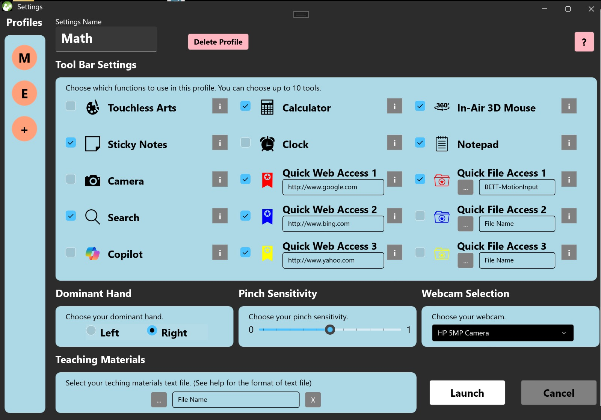
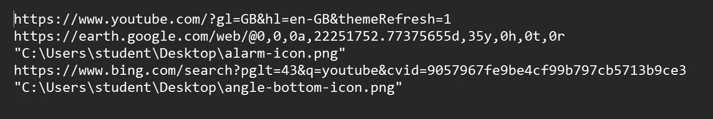
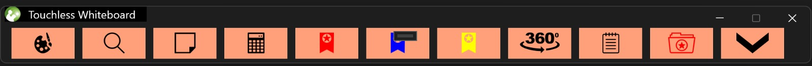
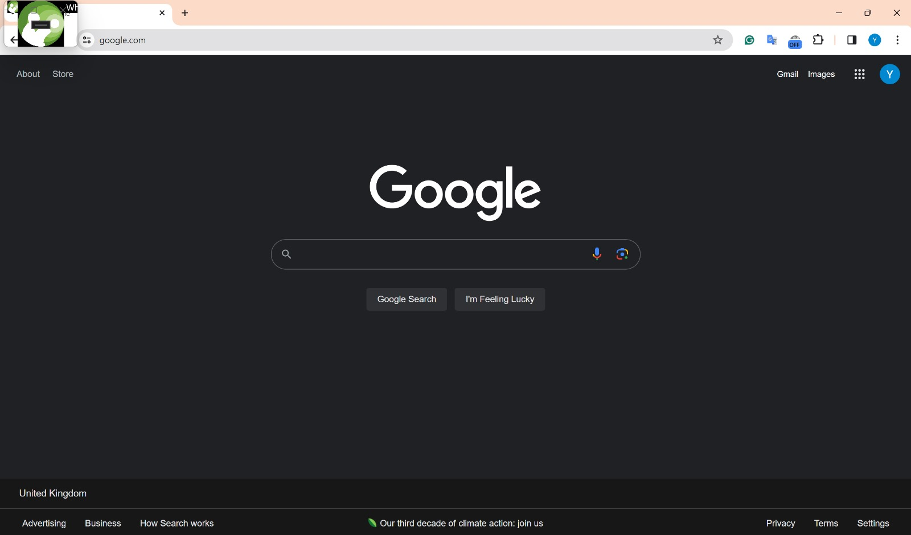
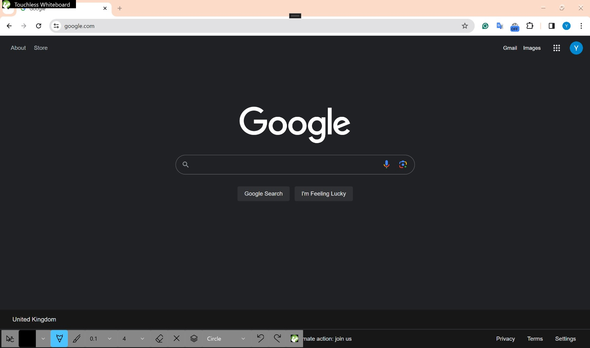
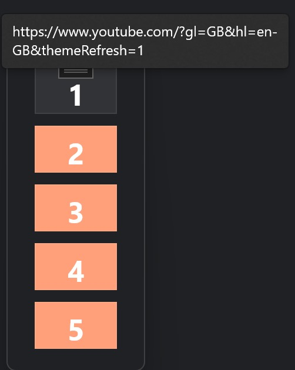

# Touchless Whiteboard

Touchless Whiteboard is a Windows application that allows users to interact with their computer using hand gestures, enabling a touchless experience. It is designed for educational purposes, allowing teachers to use it as a whiteboard and students to interact with it without needing expensive hardware such as smartboards. The application only requires a webcam and a Windows computer.

---

## Table of Contents
1. [Overview](#overview)
2. [Features](#features)
3. [System Requirements](#system-requirements)
4. [Installation & Launch](#installation--launch)
5. [Usage Instructions](#usage-instructions)
6. [Settings Window](#settings-window)
7. [Main Window](#main-window)
8. [Touchless Arts](#touchless-arts)
9. [Teaching Materials](#teaching-materials)
10. [Troubleshooting](#troubleshooting)

---

## Overview

A gesture-controlled interactive whiteboard and digital art application enabling touchless interaction for intuitive, hygienic, and creative experiences. Built on UCL's MotionInput technology, this application allows users to create, manipulate, and present content using natural hand movements captured by a webcam.

The system serves both educational and artistic purposes, featuring customizable tools, multi-user profiles, and seamless integration with various Windows applications. 

The application leverages advanced computer vision algorithms and gesture recognition techniques to translate natural hand movements into precise digital inputs, creating a responsive and intuitive user experience without requiring expensive specialized hardware.

---

## Features

- **Touchless Drawing:** Draw on a virtual canvas using hand gestures.
- **Gesture Controls:** Intuitive gestures for actions like select, move, resize, and color change.
- **Multi-mode Interface:** Switch between whiteboard and artistic creation modes.
- **Color Palette & Tool Selection:** Wide range of colors and drawing tools.
- **Gallery & Profile System:** Save, load, and manage your creations.
- **Collaborative Features:** Real-time collaboration (optional).
- **Customizable Toolbar:** Add/remove tools for a personalized experience.
- **Teaching Materials Integration:** Quick access to files and URLs for educational use.

---

## System Requirements
- Windows OS (TouchlessWhiteboard.exe is a Windows application)
- .NET Runtime (install if prompted)
- Webcam (for gesture recognition)

---

## Installation & Launch

### 1. Setting Up Visual Studio

First, you need to install Visual Studio. Here are the steps:

1. Download Visual Studio from the official website: [Visual Studio Download](https://visualstudio.microsoft.com/downloads/)
3. Run the installer and follow the prompts to install Visual Studio.
4. During installation, make sure to select the **.NET Desktop Development** workload. This includes all the necessary tools to develop desktop applications with .NET.

### 2. Cloning the GitHub Repository

Once Visual Studio is set up, you can clone the GitHub repository:

1. Open Visual Studio.
2. Click on **File > Clone or Checkout Code**.
3. Enter the URL of the GitHub repository in the **Repository Location** field.
4. Click on the **Clone** button to start the cloning process.

### 3. Running the WinUI Application

After cloning the repository, you can run the WinUI application:

1. In Visual Studio, open the **Solution Explorer** pane.
2. The solution file is located at TouchlessWhiteboard → TouchlessWhiteboard.sln
3. Right-click on the solution and select **Restore NuGet Packages** to ensure all the necessary packages are installed.
4. Press **F5** or click on the **Start Debugging** button to run the application.

---

## Usage Instructions

1. **Starting the Application:**
   - Launch the application and position yourself in view of the camera.
2. **Gesture Controls:**
   - **Open palm:** Select/move cursor
   - **Pinch gesture:** Draw/write
   - **Two fingers:** Resize/zoom
   - *(More gesture controls can be added as needed)*
3. **Switching Modes:**
   - Use the interface to switch between whiteboard and art modes.
4. **Saving Your Work:**
   - Use the save option in the interface to store your creations.

---

## Settings Window

Customize your experience in the Settings window:

### Customizable Options
- **Profile:** Create, edit, rename, and delete multiple user profiles.
- **Toolbar Settings:** Add/remove tools:
    - **Touchless Arts:** Transparent overlay for drawing and shapes.
    - **Sticky Notes:** Integrates with Microsoft Sticky Notes.
    - **Camera:** Screen capture tool.
    - **Search:** Quick Google search.
    - **Copilot:** Initiates a Copilot search.
    - **Calculator:** Access Microsoft Calculator.
    - **Clock:** Access Microsoft Clock.
    - **Quick Web Access:** Instant access to specific websites.
    - **In-Air 3D Mouse:** Enhanced navigation for 3D objects.
    - **Notepad:** Access Windows Notepad.
    - **Quick File Access:** Shortcuts to local files/folders.
- **Dominant Hand:** Select your dominant hand for gesture recognition.
- **Pinch Sensitivity:** Adjust pinch gesture sensitivity.
- **Webcam Selection:** Choose your preferred webcam.
- **Teaching Materials:** Select a text file with resource paths/URLs for quick access.

#### How to Create a Teaching Materials File
1. Create a new text file.
2. For local files, copy and paste the file path (see video):
    - [Teaching Materials 1](assets/teaching_materials_1.mp4)
3. For URLs, copy and paste the link (see video):
    - [Teaching Materials 2](assets/teaching_materials_2.mp4)
4. Add one link per line:
    
5. Save the file and select it in the settings window.

---

## Main Window

After launching, the main window displays your selected tools:

- Click a tool button to use it. The main window minimizes automatically:
    
- To return, click the button in the top-right corner.

---

## Touchless Arts

If enabled in settings, select Touchless Arts from the main window:

**Features:**

- **Mouse Cursor:** Select options or move shapes.
- **Color Picker:** Choose pen/highlighter/shape border color.
- **Pen:** Draw thin lines or write.
- **Highlighter:** Highlight content.
- **Highlighter Transparency:** Adjust highlight opacity.
- **Pen Size:** Change pen thickness.
- **Eraser:** Erase drawings.
- **Clear All:** Clear the canvas.
- **Shapes:** Place and resize shapes (circle, square, triangle).
- **Undo/Redo:** Undo or redo actions.
- **Go Back to Toolbar:** Close canvas, retain drawings.

**Demo:**
[Touchless Arts Demo](assets/touchless_arts.mp4)

---

## Teaching Materials

When a teaching materials file is set, a window appears with buttons for each resource:

### Features
- **Tooltip:** Hover to see which resource each button opens.
- **Position:** Default is left-center, but window is movable.

---

## Troubleshooting

- **.NET Runtime Error:**
    - Install the required .NET Runtime as prompted.
    - Relaunch the application.
- **Webcam Not Detected:**
    - Ensure your webcam is connected and selected in settings.
- **Gesture Recognition Issues:**
    - Adjust lighting and camera angle.
    - Calibrate pinch sensitivity in settings.
- **Other Issues:**
    - Restart the application.
    - Check for software updates.